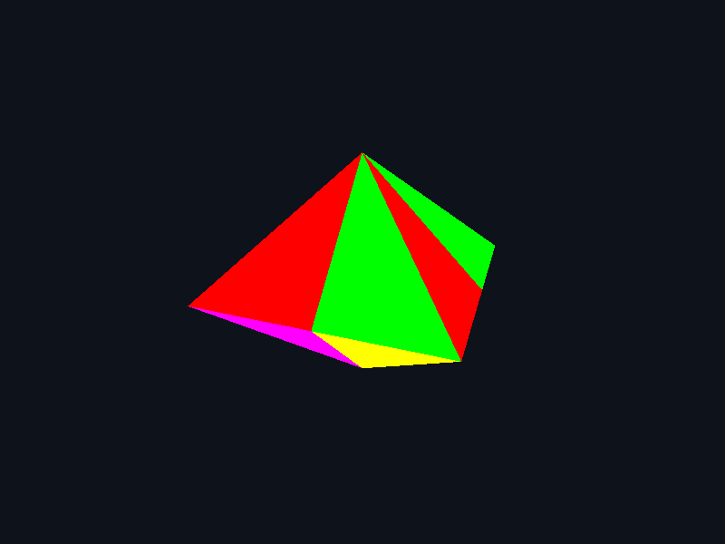

# Computación Gráfica e Interacción Humano Computadora

**Alumno:** Alan Rogelio Barrientos Ramírez  
**Número de cuenta:** 422022019  
**Grupo de teoría:** 6  
**Grupo de laboratorio:** 3  
**Semestre:** 2027-1

## Práctica 03 — Cohete y rombo de ocho pirámides

**Fecha de entrega:** 12 de septiembre de 2026.

El cohete está construido con instancias de cilindros, conos, esferas, cubos y pirámides. El segundo ejercicio une ocho pirámides de base cuadrada: cuatro arriba y cuatro abajo. Cada pirámide tiene las caras triangulares roja, verde, amarilla y magenta, y la base azul.

### Entrega

- [Reporte en PDF](Reporte/R03-422022019.pdf).
- [ZIP de Release: ejecutable y PDB](Entrega/P03-422022019.zip).
- [Archivos de salida](x64/Release).
- [Main de los dos ejercicios](Proyecto/practica3.cpp).

### Ejecución

Abrir `Proyecto/Practica03.sln` en Visual Studio con desarrollo de escritorio en C++, seleccionar `Release | x64` y ejecutar con Ctrl + F5. El proyecto contiene un solo main.

El ZIP contiene únicamente `Practica03.exe` y `Practica03.pdb`, compilados en Windows como `Release | x64`. El PDF y el main se entregan por separado. Para ejecutar el EXE, conservar junto a él `glew32.dll` y la carpeta `shaders` del proyecto original; esas dependencias no están incluidas en el ZIP. No hay shaders nuevos ni modificados.

| Tecla | Acción |
|---|---|
| 1 | Mostrar el cohete |
| 2 | Mostrar el rombo de ocho pirámides |
| 3 | Revisar una pirámide y sus cinco caras |
| E / R / T | Girar en X / Y / Z |
| Esc | Cerrar |

Las modificaciones están explicadas en comentarios dentro del código. Se utilizan `shader.vert`, `shadercolor.vert` y `shader.frag`.

### Capturas

